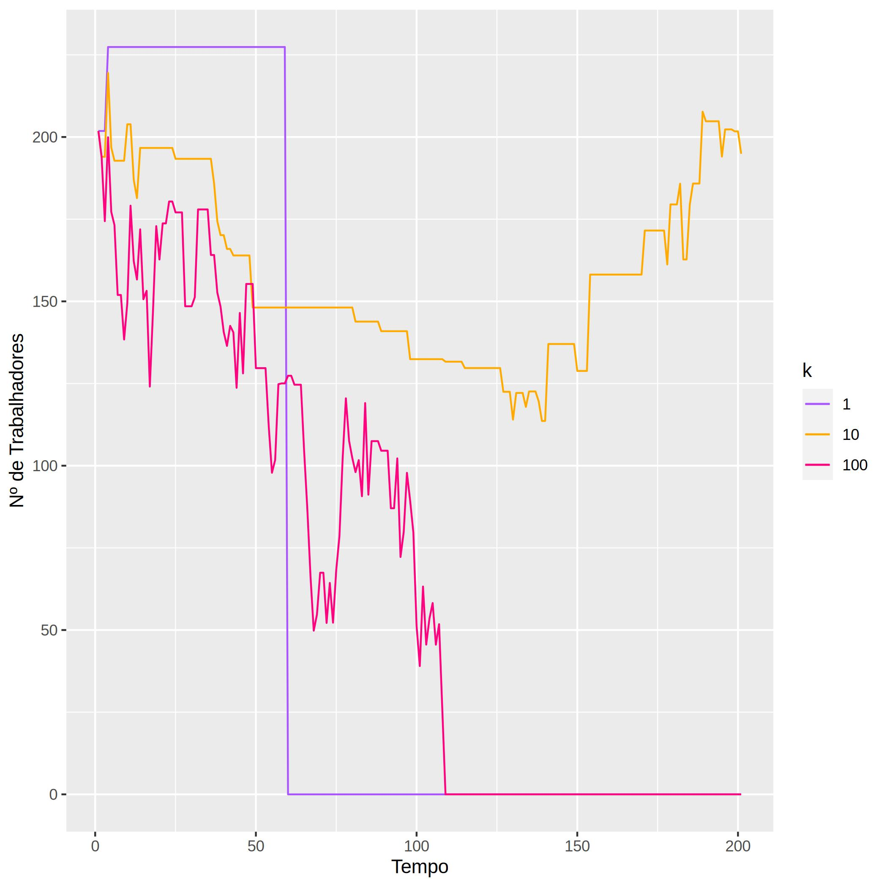

# Simulação de Monte Carlo simples para isolar e ilustrar o efeito da disposição para despedir trabalhadores numa empresa em recessão.

## Função de modelo

Começa-se por definir uma curva que relaciona a rentabilidade económica de uma empresa (R) em função do número de trabalhadores (n) e do tempo (t). Esta curva pode ser deduzida integrando a curva do lucro marginal dos trabalhadores (lucro adicional trazido à empresa por cada trablhador adicional) e subtraindo as despesas totais em salários.

## Algoritmo

Por cada timestep, gera-se aleatoriamente uma proposta para o novo nº de trabalhadores, e calcula-se o `ΔR` em relação ao timestep anterior.

Se ΔR for positivo, a empresa aceita automaticamente a proposta. Se for negativo, aceita com probalidade `P = exp(ΔR/k)`, sendo `k` a constante que mede a disposição da empresa em despedir trabalhadores.

Esta função de probabilidade vem de uma adaptação do [critério de Metrópolis](http://csg.sph.umich.edu/abecasis/class/2006/615.19.pdf), `P = min(1,exp(-ΔE/T))`.
Normalmente é usado em simulações de redes cristalinas, em que a função modelo `E` é a energia da rede cristalina, e `T` a temperatura. O critério reflete o facto de que um sistema tende a diminuir a sua energia se possível (`P = 1` se `ΔE < 0`), e que temperaturas maiores permitem aceder estados energéticos mais altos e instáveis.

## Código

### Python
O ficheiro `simul.py` é a versão mais simples e fácil de ler, apenas contém o esqueleto da simulação.
Ao executar `python simul.py`, a simulação é corrida para uma empresa, e dá apenas um output textual dos valor atual da função e dos seus parâmetros por cada iteração.

### R
O ficheiro `simul.R` contém, adicionalmente, toda a maquinaria para gerar gráficos.
Ao executar `Rscript simul.R`, a simulação é corrida em paralelo para todas as empresas, e gera-se um gráfico com a posição das empresas na curva `R` por cada `graph_step`. No final, são gerados vários gráficos relevantes, como os cortes de `R` em relação a `t` e `n` para cada empresa.

## Gráficos
<figure>

<figcaption align = "center"><b>Overview de uma simulação para 3 empresas</b></figcaption>
</figure>

<figure>

<figcaption align = "center"><b>Corte de R em t</b></figcaption>
</figure>

<figure>

<figcaption align = "center"><b>Corte de R em n</b></figcaption>
</figure>

<figure>

<figcaption align = "center"><b>Emprego marginal até à 1ª falência</b></figcaption>
</figure>

<figure>

<figcaption align = "center"><b>Histograma das `Δn` aceites para `k = 1`</b></figcaption>
</figure>

<figure>

<figcaption align = "center"><b>Histograma das `Δn` aceites para `k = 1`</b></figcaption>
</figure>

<figure>

<figcaption align = "center"><b>Histograma das `Δn` aceites para `k = 1`</b></figcaption>
</figure>

