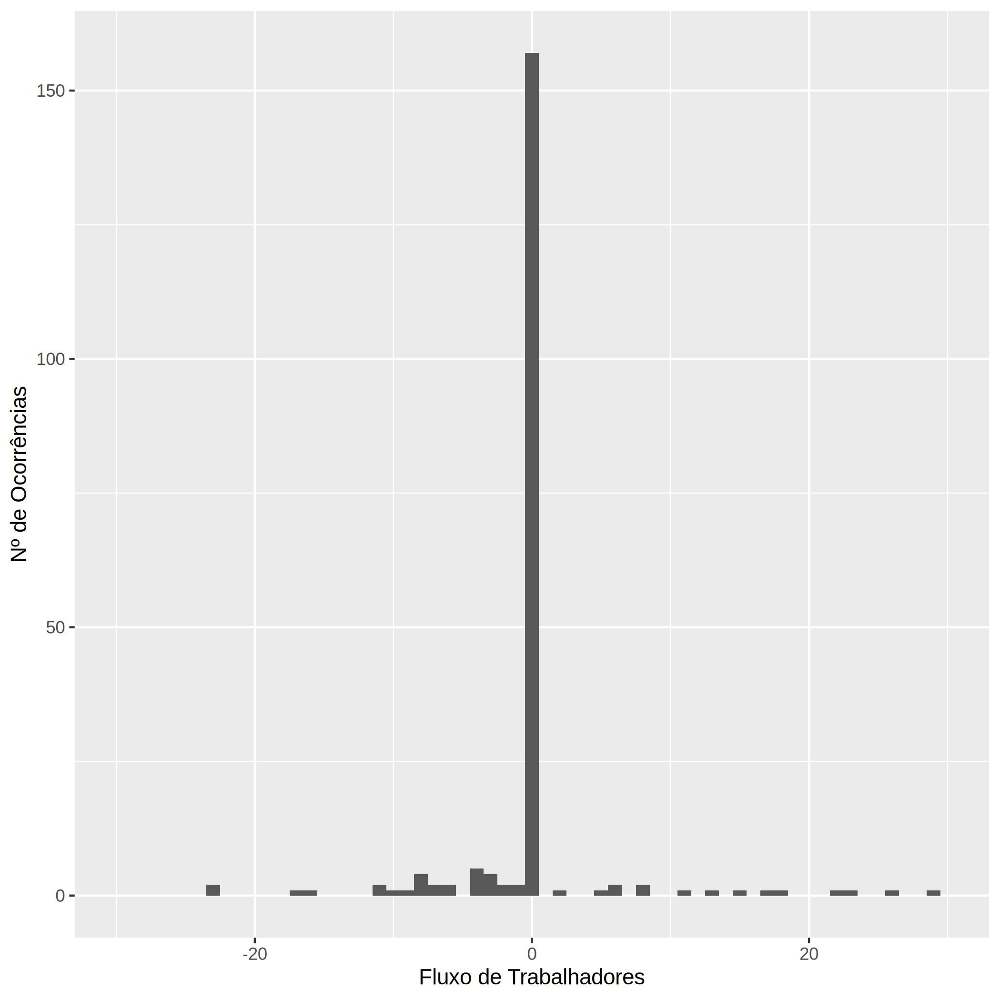

# Simulação de Monte Carlo simples para isolar e ilustrar o efeito da disposição para despedir trabalhadores numa empresa em recessão

## Função-modelo

Começa-se por definir uma curva que relaciona a rentabilidade económica de uma empresa (`R`) em função do número de trabalhadores (`n`) e do tempo (`t`). Esta curva pode ser deduzida integrando a curva da receita marginal dos trabalhadores (receita trazida à empresa por cada trabalhador adicional) e subtraindo as despesas totais em salários.

## Algoritmo

Por cada timestep, gera-se aleatoriamente uma proposta para o novo nº de trabalhadores, e calcula-se o `ΔR` em relação ao timestep anterior.

Se ΔR for positivo, a empresa aceita automaticamente a proposta. Se for negativo, aceita com probalidade `P = exp(ΔR/k)`, sendo `k` a constante que mede a disposição da empresa em despedir trabalhadores.

Esta função de probabilidade vem de uma adaptação do [critério de Metropolis](http://csg.sph.umich.edu/abecasis/class/2006/615.19.pdf#page=15), `P = min(1,exp(-ΔE/T))`.
Normalmente é usado em simulações de redes cristalinas, em que a função modelo `E` é a energia da rede cristalina, e `T` a temperatura. O critério reflete o facto de que um sistema tende a diminuir a sua energia se possível (`P = 1` se `ΔE < 0`), e que temperaturas maiores permitem aceder estados energéticos mais altos e instáveis.

## Código

### Python
O ficheiro `simul.py` é a versão mais simples e fácil de ler, apenas contém o esqueleto da simulação.

Ao executar `python simul.py`, a simulação é corrida para uma empresa, e dá apenas um output textual do valor atual da função-modelo e dos seus parâmetros, por cada iteração.

### R
O ficheiro `simul.R` contém, adicionalmente, toda a maquinaria para gerar gráficos.

Ao executar `Rscript simul.R`, a simulação é corrida em paralelo para todas as empresas, e gera-se um gráfico com a posição das empresas na curva `R` por cada `graph_step`, que depois podem ser combinados para formar um GIF de overview.

No final, são gerados vários gráficos relevantes, como o corte de `R` em relação a `n`, e `n(t)`, para cada empresa.

## Gráficos
<figure>

<h2 align = "center"><b>Overview de uma simulação para 3 empresas</b>

</figure>
 
 

<figure>

<h2 align = "center"><b>Emprego em função de <code>t</code></b>

</figure>
 
 

<figure>

<h2 align = "center"><b>Corte de <code>R(t,n)</code> em <code>n</code></b>

</figure>
 
 

<figure>

<h2 align = "center"><b>Emprego marginal até à 1ª falência</b>

</figure>
 
 

<figure>

<h2 align = "center"><b>Histograma das <code>Δn</code> aceites para <code>k = 1</code></b>

</figure>
 
 

<figure>

<h2 align = "center"><b>Histograma das <code>Δn</code> aceites para <code>k = 10</code></b>

</figure>
 
 

<figure>

<h2 align = "center"><b>Histograma das <code>Δn</code> aceites para <code>k = 100</code></b>

</figure>
 
 

